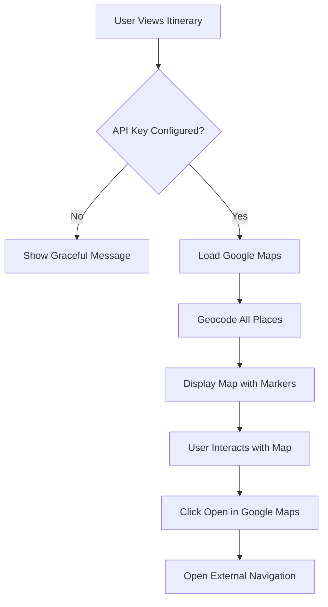

# Google Maps Integration - Implementation Summary

## 🎉 Successfully Implemented!

Google Maps integration has been added to your AI Travel Planner application. Users can now view their itineraries on an interactive map and get directions in Google Maps.

## ✨ Features Implemented

### 1. **Interactive Embedded Map**
- Full Google Maps embedded on itinerary detail pages
- Automatic geocoding of all place names to coordinates
- Numbered markers showing the order of locations
- Click markers to see location names in info windows
- Auto-zoom to fit all locations perfectly
- Shows geocoding success rate (e.g., "12 of 15 locations found")

### 2. **External Navigation Button**
- "Open in Google Maps" button
- Creates directions URL with all locations
- Opens in new tab (works on mobile & desktop)
- No API key required for this feature
- Provides turn-by-turn navigation

### 3. **Geocoding System**
- Converts place names to GPS coordinates
- Combines place name with city for better accuracy
- Handles rate limiting with small delays
- Calculates optimal map center point
- Graceful error handling for failed geocoding

### 4. **Graceful Fallback**
- Map only shows when API key is configured
- Friendly message if API key is missing
- App works perfectly without maps (optional feature)
- No errors or crashes if maps are disabled

## 📁 Files Created

```
travel-planner/
├── src/
│   ├── lib/
│   │   ├── config/
│   │   │   └── google-maps.ts                    # API key configuration
│   │   └── utils/
│   │       └── geocoding.ts                       # Geocoding utilities
│   └── components/
│       ├── itinerary-map.tsx                      # Interactive map component
│       └── google-maps-button.tsx                 # External navigation button
├── GOOGLE_MAPS_SETUP.md                           # Setup instructions
└── GOOGLE_MAPS_IMPLEMENTATION.md                  # This file
```

## 📝 Files Modified

- `src/app/itinerary/[id]/page.tsx` - Added map section to itinerary detail page
- `package.json` - Added `@googlemaps/js-api-loader` dependency

## 🛠️ Technical Details

### Dependencies Installed

```json
{
  "@googlemaps/js-api-loader": "^1.x.x"
}
```

### Environment Variables Required

```bash
NEXT_PUBLIC_GOOGLE_MAPS_API_KEY=your_api_key_here
```

### API Usage

**APIs Used:**
- Google Maps JavaScript API (for displaying maps)
- Geocoding API (for converting place names to coordinates)

**Cost per itinerary view:**
- 1 map load (~$0.007)
- N geocoding requests where N = number of places (~$0.005 each)
- Example: 15 places = ~$0.082 per view

**Free Tier Coverage:**
- $200/month free credit
- ~28,000 map loads per month free
- ~40,000 geocoding requests per month free
- **Estimated: ~2,800 full itinerary views/month FREE**

## 🎯 How It Works

### User Flow

1. User opens an itinerary detail page
2. Below the booking card, a "Map View" section appears (if API key configured)
3. Map loads and geocodes all locations (shows loading spinner)
4. Interactive map displays with numbered markers
5. User can:
   - Click markers to see location names
   - Zoom and pan the map
   - Click "Open in Google Maps" for turn-by-turn directions

### Technical Flow



### Component Architecture

```typescript
// ItineraryMap Component (Client-side)
- Loads Google Maps JavaScript API
- Geocodes all place names sequentially
- Creates map centered on all locations
- Adds numbered markers with info windows
- Fits bounds to show all locations

// GoogleMapsButton Component (Client-side)
- Simple button component
- Builds Google Maps directions URL
- Opens in new tab for external navigation
- No API calls needed

// Geocoding Utility (Server & Client)
- geocodePlace(): Single place geocoding
- geocodeItineraryPlaces(): Batch geocoding with delays
- calculateCenter(): Find optimal map center
```

## 🔧 Configuration Options

### Google Maps Config (`src/lib/config/google-maps.ts`)

```typescript
export const GOOGLE_MAPS_CONFIG = {
  apiKey: process.env.NEXT_PUBLIC_GOOGLE_MAPS_API_KEY || '',
  libraries: ['places', 'geometry', 'marker'],
  version: 'weekly',
};
```

### Map Display Options

In `src/components/itinerary-map.tsx`, you can customize:
- Initial zoom level (currently: 13)
- Map controls (currently: all enabled)
- Marker style (currently: numbered labels)
- Info window content
- Animation effects

## 🚀 Setup Instructions

### Quick Start

1. **Get Google Maps API Key** (see `GOOGLE_MAPS_SETUP.md`)
   - Create Google Cloud project
   - Enable Maps JavaScript API & Geocoding API
   - Create and restrict API key

2. **Add to Environment Variables**
   ```bash
   # Create .env.local file
   NEXT_PUBLIC_GOOGLE_MAPS_API_KEY=your_api_key_here
   ```

3. **Restart Development Server**
   ```bash
   npm run dev
   ```

4. **Test the Feature**
   - Open any itinerary
   - Scroll to "Map View" section
   - Verify map loads and markers appear

## 📊 Example Usage

### With API Key Configured

```
┌─────────────────────────────────────────┐
│  Map View                [Open in Maps] │
├─────────────────────────────────────────┤
│                                         │
│    [Interactive Google Map]             │
│    ● 1 - Eiffel Tower                   │
│    ● 2 - Louvre Museum                  │
│    ● 3 - Notre-Dame                     │
│                                         │
│    [12 of 15 locations found]           │
└─────────────────────────────────────────┘

Click markers to see location names.
Use the button above to open directions.
```

### Without API Key

```
┌─────────────────────────────────────────┐
│                                         │
│        🗺️                                │
│  Map view is not available.             │
│  Please configure Google Maps API key.  │
│                                         │
└─────────────────────────────────────────┘
```

## 🎨 UI/UX Features

✅ **Responsive Design** - Works on mobile and desktop  
✅ **Loading State** - Shows spinner with progress message  
✅ **Error Handling** - Friendly error messages  
✅ **Info Windows** - Click markers for details  
✅ **Auto-Zoom** - Fits all locations perfectly  
✅ **Map Controls** - Zoom, street view, map type selector  
✅ **External Navigation** - One-click Google Maps directions  
✅ **Geocoding Counter** - Shows success rate  

## 🔮 Future Enhancement Ideas

### Phase 2 (Optional)
1. **Coordinate Caching**
   - Store geocoded coordinates in database
   - Avoid re-geocoding on each page load
   - Significantly reduce API costs

2. **Day-by-Day View**
   - Toggle to show only locations for specific day
   - Different marker colors per day
   - Smoother route visualization

3. **Route Lines**
   - Draw polylines between locations
   - Show driving/walking routes
   - Display travel time estimates

4. **Place Details**
   - Use Places API for ratings, photos
   - Show opening hours
   - Display user reviews

5. **Custom Map Styles**
   - Brand-matched color schemes
   - Hide/show map features
   - Better visual integration

### Phase 3 (Advanced)
- Export to mobile map apps (Apple Maps, Waze)
- Offline map support
- Live traffic information
- Public transit directions
- Multi-day route optimization

## 📈 Testing & Monitoring

### Manual Testing Checklist

- [ ] Map loads on itinerary detail page
- [ ] All location markers appear
- [ ] Markers are numbered correctly
- [ ] Clicking markers shows info windows
- [ ] "Open in Google Maps" button works
- [ ] Map zooms to fit all locations
- [ ] Mobile responsive layout
- [ ] Loading state displays correctly
- [ ] Error states handled gracefully
- [ ] Works without API key (shows message)

### Monitoring

**Google Cloud Console:**
- Monitor API usage daily
- Set up billing alerts at $50, $100, $150
- Check for unusual spikes in traffic
- Review failed geocoding requests

**Application Logs:**
- Watch for geocoding warnings
- Check for map loading errors
- Monitor API key issues

## 🐛 Common Issues & Solutions

See `GOOGLE_MAPS_SETUP.md` for detailed troubleshooting, including:
- Map not showing
- API key errors
- Geocoding failures
- Rate limiting issues
- Billing problems

## 📚 Resources

- [Google Maps Platform Documentation](https://developers.google.com/maps/documentation)
- [Google Maps JavaScript API](https://developers.google.com/maps/documentation/javascript)
- [Geocoding API](https://developers.google.com/maps/documentation/geocoding)
- [API Usage & Billing](https://console.cloud.google.com/google/maps-apis)

## ✅ Summary

**What was implemented:**
- ✅ Interactive embedded Google Maps
- ✅ Automatic place geocoding
- ✅ Numbered location markers
- ✅ Info windows on click
- ✅ External Google Maps navigation
- ✅ Responsive design
- ✅ Loading & error states
- ✅ Graceful fallback without API key
- ✅ Comprehensive documentation

**Ready to use:**
- Add your Google Maps API key to `.env.local`
- Restart your dev server
- View any itinerary to see the map!

**Cost estimate:**
- ~2,800 complete itinerary views/month **FREE**
- After that: ~$0.08 per itinerary view

🎉 **The Google Maps integration is complete and ready to use!**


